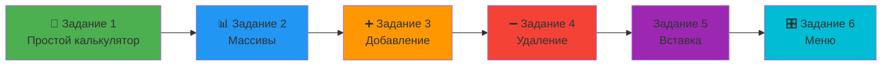

# 🎓 Teach C++ Plus Plus

<div align="center">

[](https://isocpp.org/)
[]()
[]()
[]()

**Полный курс программирования на C++ от основ до продвинутых тем**

</div>

---

## 📖 О курсе

<div align="center">

```
╔══════════════════════════════════════════════════════════╗
║                                                          ║
║   🚀 От нуля до уверенного программиста на C++!          ║
║                                                          ║
║   Практический курс с пошаговыми заданиями               ║
║   и подробной документацией                              ║
║                                                          ║
╚══════════════════════════════════════════════════════════╝
```

</div>

### 🎯 Что вас ждёт:

<div align="center">

| 📚 Теория | 💻 Практика |  Задачи | 📝 Документация |
|-----------|-------------|-----------|-----------------|
| Подробные объяснения | Готовый код | Упражнения | Пошаговые инструкции |

</div>

---

##  Структура репозитория

```
Teach_C_Plus_Plus/
│
├── 📁 Код/
│   ├── Код 1 просто.md          ← Базовые примеры
│   ├── Код 1 сложно.md          ← Продвинутые решения
│   ├── Код 2 просто.md
│   ├── Код 2 сложно.md
│   └── ... (всего 24 файла)
│
├── 📁 Задачи/
│   ├── Задание 1 «Простой калькулятор».md
│   ├── Задание 2 «Массив чисел и его свойства».md
│   ├── Задание 3 «Добавление элемента в массив».md
│   ├── Задание 4 «Удаление элемента из массива».md
│   ├── Задание 5 «Вставка элемента в середину массива».md
│   ├── Задание 6 «Динамический массив с меню».md
│   ├── Задача 7 «Создание и анализ матрицы».md
│   ├── Задача 8 «Диагонали матрицы».md
│   ├── Задача 9 «Транспонирование матрицы».md
│   ├── Задача 10 «Поворот матрицы на 90 градусов».md
│   ├── Задача 11 «Сложение двух матриц».md
│   ── Задача 12 «Зеркальное отражение матрицы».md
│
├── 📁 Документация/
│   ├── Документация 1 просто.md     ← Подробные объяснения
│   ├── Документация 1 сложно.md     ← Углублённый разбор
│   └── ... (полная документация)
│
└── README.md                        ← Вы здесь!
```

---

##  Программа обучения

### 🔰 Уровень 1: Основы (Задания 1-6)

<div align="center">



</div>

**Что изучаем:**
- ✅ Переменные и типы данных (`int`, `double`, `char`)
- ✅ Ввод/вывод (`cin`, `cout`)
- ✅ Условные операторы (`if-else`, `switch`)
- ✅ Одномерные массивы
- ✅ Динамические массивы
- ✅ Циклы (`for`, `while`, `do-while`)
- ✅ Создание меню

---

### 🔥 Уровень 2: Матрицы (Задания 7-12)

<div align="center">

```
┌─────────────────────────────────────────────────────────┐
│                    📊 МАТРИЦЫ                           │
├─────────────────────────────────────────────────────────┤
│                                                         │
│   Задание 7        Задание 8        Задание 9           │
│   ┌─────────┐     ┌─────────┐     ─────────┐            │
│   │ Создание│     │Диагонали│     │Транспон.│           │
│   │  и анализ│     │         │     │         │          │
│   ─────────┘     └─────────┘     └─────────┘            │
│                                                         │
│   Задание 10       Задание 11       Задание 12          │
│   ┌─────────┐     ┌─────────┐     ┌─────────┐           │
│   │ Поворот │     │Сложение │     │ Зеркало │           │
│   │  90°    │     │         │     │         │           │
│   └─────────┘     └─────────┘     └─────────┘           │
│                                                         │
└─────────────────────────────────────────────────────────┘
```

</div>

**Что изучаем:**
- ✅ Двумерные массивы (матрицы)
- ✅ Работа с индексами
- ✅ Матричные операции
- ✅ Алгоритмы преобразования
- ✅ Анализ структур данных

---

## 🎨 Примеры кода

### <div align="center">📝 Задание 1: Простой калькулятор</div>

```cpp
#include <iostream>
using namespace std;

int main() {
    setlocale(LC_ALL, "Russian");
    
    double num1, num2;
    char operation;
    
    cout << "=== ПРОСТОЙ КАЛЬКУЛЯТОР ===" << endl;
    cout << "Введите первое число: ";
    cin >> num1;
    
    cout << "Введите второе число: ";
    cin >> num2;
    
    cout << "Выберите операцию (+, -, *, /): ";
    cin >> operation;
    
    double result;
    bool valid = true;
    
    switch(operation) {
        case '+':
            result = num1 + num2;
            break;
        case '-':
            result = num1 - num2;
            break;
        case '*':
            result = num1 * num2;
            break;
        case '/':
            if (num2 == 0) {
                cout << "❌ Ошибка: деление на ноль!" << endl;
                valid = false;
            } else {
                result = num1 / num2;
            }
            break;
        default:
            cout << "❌ Ошибка: неизвестная операция!" << endl;
            valid = false;
    }
    
    if (valid) {
        cout << "✅ Результат: " << result << endl;
    }
    
    return 0;
}
```

**Пример работы:**
```
=== ПРОСТОЙ КАЛЬКУЛЯТОР ===
Введите первое число: 10
Введите второе число: 5
Выберите операцию (+, -, *, /): *
✅ Результат: 50
```

---

## 📊 Статистика курса

<div align="center">

| Показатель | Значение |
|------------|----------|
| 📚 Всего заданий | 12 |
| 💻 Примеров кода | 24 (простой + сложный) |
| 📄 Файлов документации | 25+ |
| 🎯 Тем | 2 основных (Массивы, Матрицы) |
| ⏱️ Время прохождения | 2-4 недели |

</div>

---

## 🚀 Как начать?

### 1️ Клонируйте репозиторий

```bash
git clone https://github.com/Ghostosmoke/Teach_C_Plus_Plus.git
cd Teach_C_Plus_Plus
```

### 2️⃣ Выберите уровень сложности

<div align="center">

```
┌─────────────────────────────────────────┐
│                                         │
│   🟢 ПРОСТОЙ УРОВЕНЬ                    │
│   • Базовые концепции                   │
│   • Пошаговые объяснения                │
│   • Готовые шаблоны                     │
│                                         │
│   🔴 СЛОЖНЫЙ УРОВЕНЬ                    │
│   • Продвинутые техники                 │
│   • Оптимизация кода                    │
│   • Самостоятельные решения             │
│                                         │
└─────────────────────────────────────────┘
```

</div>

### 3️⃣ Начните с первого задания

```
📂 Задачи/
  └── Задание 1 «Простой калькулятор».md
       ↓
📂 Код/
  ├── Код 1 просто.md
  ── Код 1 сложно.md
       ↓
 Документация/
  ├── Документация 1 просто.md
  └── Документация 1 сложно.md
```

---

## 🎓 Методика обучения

<div align="center">

```
     ╔═══════════════════════════════════╗
     ║                                   ║
     ║      📖 ЧИТАЙТЕ ТЕОРИЮ            ║
     ║                                   ║
     ║      Изучайте документацию        ║
     ║      Понимайте концепции          ║
     ║                                   ║
     ╚═══════════╤═══════════════════════╝
                 │
                 ▼
     ╔═══════════════════════════════════╗
     ║                                   ║
     ║      💻 ПИШИТЕ КОД                ║
     ║                                   ║
     ║      Используйте примеры          ║
     ║      Экспериментируйте            ║
     ║                                   ║
     ╚═══════════╤═══════════════════════╝
                 │
                 ▼
     ╔═══════════════════════════════════╗
     ║                                   ║
     ║      🧠 РЕШАЙТЕ ЗАДАЧИ            ║
     ║                                   ║
     ║      Закрепляйте знания           ║
     ║      Развивайте мышление          ║
     ║                                   ║
     ╚═══════════╤═══════════════════════╝
                 │
                 ▼
     ╔═══════════════════════════════════╗
     ║                                   ║
     ║      ✅ ПРОВЕРЯЙТЕ РЕЗУЛЬТАТ      ║
     ║                                   ║
     ║      Сравнивайте с образцом       ║
     ║      Исправляйте ошибки           ║
     ║                                   ║
     ╚═══════════════════════════════════╝
```

</div>

---

##  Советы для успешного обучения

<div align="center">

| 💭 Совет | Описание |
|----------|----------|
| 📝 **Конспектируйте** | Записывайте важные моменты |
| 🔄 **Повторяйте** | Возвращайтесь к пройденному |
| 🧪 **Экспериментируйте** | Меняйте код, смотрите что будет |
| ❓ **Задавайте вопросы** | Не понимайте - спрашивайте |
| 🎯 **Практикуйтесь** | Кодьте каждый день |

</div>

---

## ️ Требования

<div align="center">

```
┌─────────────────────────────────────────────┐
│                                             │
│  🖥️  Компьютер с ОС (Windows/Linux/Mac)     │
│                                             │
│  💻  Компилятор C++ (g++, MinGW, MSVC)      │
│                                             │
│  📝  Текстовый редактор (VS Code, и др.)    │
│                                             │
│  🧠  Желание учиться!                       │
│                                             │
└─────────────────────────────────────────────┘
```

</div>

**Рекомендуемые IDE:**
-  [Visual Studio Code](https://code.visualstudio.com/) + C++ extension
-  [Code::Blocks](http://www.codeblocks.org/)
- 🔵 [CLion](https://www.jetbrains.com/clion/)
- 🔵 [Visual Studio](https://visualstudio.microsoft.com/)

---

## 📚 Дополнительные ресурсы

### Книги:
- 📖 "C++ для чайников" - Дин Миллер
- 📖 "Язык программирования C++" - Бьярне Страуструп
- 📖 "Эффективное программирование на C++" - Скотт Мейерс

### Онлайн-ресурсы:
- 🌐 [cppreference.com](https://en.cppreference.com/) - Справочник
-  [LearnCpp.com](https://www.learncpp.com/) - Учебник
-  [Stack Overflow](https://stackoverflow.com/) - Вопросы и ответы

---

##  Вклад в проект

<div align="center">

```
     ❤️  ПОНРАВИЛСЯ КУРС?  ❤️
     
     ⭐ Поставьте звезду на GitHub!
     
     🔧 Нашли ошибку? Создайте Issue!
     
     💡 Есть идея? Предложите Pull Request!
```

</div>

---

## 📞 Контакты и поддержка

<div align="center">

| 📧 GitHub | [@Ghostosmoke](https://github.com/Ghostosmoke) |
|-----------|------------------------------------------------|
| 📁 Репозиторий | [Teach_C_Plus_Plus](https://github.com/Ghostosmoke/Teach_C_Plus_Plus) |

</div>

---

## 📜 Лицензия

<div align="center">

Этот образовательный проект создан для изучения C++.

**Используйте знания во благо! 🚀**

</div>

---

<div align="center">

```
╔══════════════════════════════════════════════════════════╗
║                                                          ║
║           🎉 УДАЧИ В ИЗУЧЕНИИ C++! 🎉                    ║
║                                                          ║
║              Пусть ваш код компилируется                 ║
║              без ошибок с первого раза!                  ║
║                                                          ║
║                     Made with ❤️                         ║
║                                                          ║
╚══════════════════════════════════════════════════════════╝
```

</div>

---

<div align="center">

[](#-teach-c-plus-plus)

</div>
```
